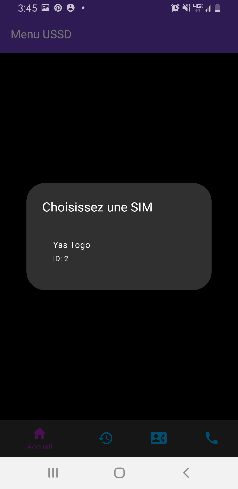

# Gestion de Menu USSD

Gestion de Menu USSD est une application Flutter qui offre une interface intuitive pour exécuter des codes USSD. Elle permet de réaliser des opérations telles que le transfert d'argent ou de crédit via TMoney et Flooz.

## Fonctionnalités

- Interface utilisateur intuitive pour l'exécution des codes USSD
- Transfert d'argent via TMoney
- Transfert de crédit via Flooz
- Gestion des contacts et historique des transactions
- Consulter le solde 

## Getting Started

Ce projet est un point de départ pour une application Flutter.

### Prérequis

- Flutter SDK
- Android Studio ou Visual Studio Code

### Installation

1. Clonez le dépôt :
   ```sh
   git clone https://github.com/votre-utilisateur/gestion_menu_ussd.git
   ```
2. Accédez au répertoire du projet :
   ```sh
   cd gestion_menu_ussd
   ```
3. Installez les dépendances :
   ```sh
   flutter pub get
   ```

### Exécution

Pour exécuter l'application sur un émulateur ou un appareil physique, utilisez la commande suivante :

```sh
flutter run
```

## Captures d'écran

Voici quelques captures d'écran de l'application :



